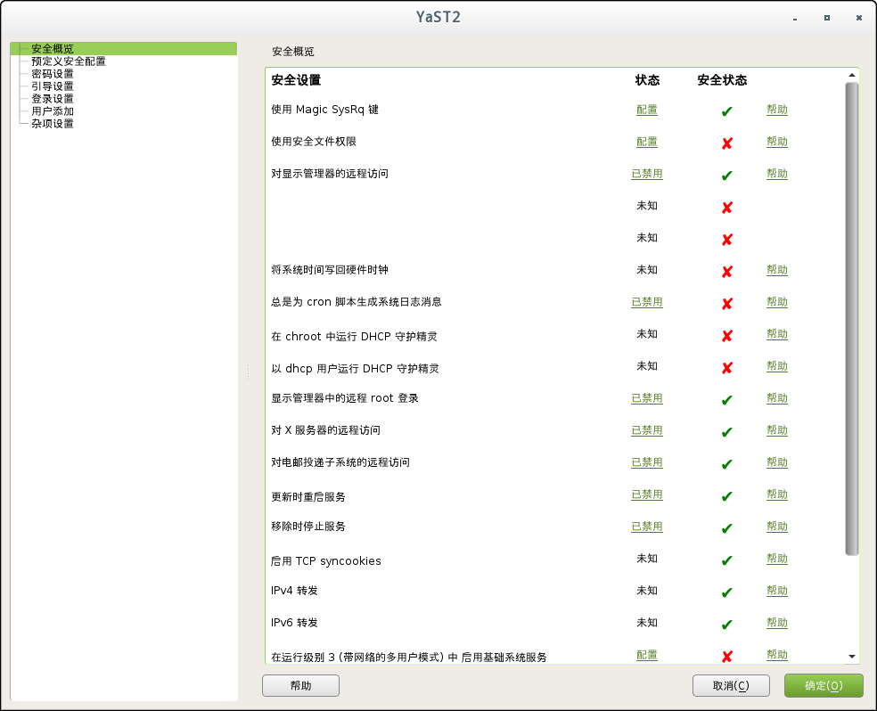

*************************************************************
第八章：使用 YaST 配置安全设置
*************************************************************

YaST 模块的 *安全和强化中心* 为 openSUSE 的安全相关设置提供了集中统一的接口。可以使用它来配置安全方面设置，如登陆程序，密码创建，引导全线，用户创建，以及默认文件权限。可以通过 YaST控制中心 的 :menuselection:`安全和用户 --> 安全和强化中心` 进行启动。*安全中心* 会话框总是以 *安全概览* 为启动页面，其他配置会话可以通过右侧面板进行选择。

安全概览
=============================================================

*安全概览* 显示一个全面的系统重要安全设置的列表。列表中每一项的安全状态都很清楚的进行显示。绿色检查标记表示该项是安全的，而红色的叉号则表示该项为非安全状态。点击 :menuselection:`帮助` 将会显示如何确保安全的设置信息概览。如果希望修改相关设置，可以点击 *状态* 列的对应链接。根据不同的设置，可以选择如下的选项：

* **已启用/已禁用**

  点击该项将会修改设置状态为已禁用或者已启用。

* **配置**

  点击该项将会启动 YaST 模块进行配置，在离开该模块后将会返回到 *安全概览* 。

* **未知**

  对于未安装的服务，设置状态显示为未知，这些设置不会带来任何的安全隐患。
  
  

   
   附图 8.1: YaST 安全和强化中心 - 安全概览

预定义安全配置
=============================================================

openSUSE 有一系列三个 *预定义安全配置* ，这些配置对 *安全中心* 模块中所有可用的配置产生影响。每个配置都可以从右侧的面板中根据自己需要进行修改。可选项如下：

* **家庭工作站**

  该设置用于完全没有网络连接的电脑（包括以太网）。该设置仅提供预定义配置的最低安全配置。

* **联网工作站**

  该配置用于任何连接到网络的工作站（包括以太网）。

* **网络服务器**

  该设置用于提供网络服务的及其，例如 web 服务器，文件服务器，命名服务器，等。该设置提供预定义安全配置的最高安全配置。

* **自定义配置**

  预选的 *自定义配置* （在打开 *预定义安全配置* 会话时）表明，预定义的安全设置已经做了某些改动，选择该选项不会对当前配置产生影响，您必须在 *安全概览* 中进行修改。

密码配置
=============================================================

很容易猜测出来的密码将会是一个很重大的安全问题。 *密码配置* 会话框提供一些方法保证仅使用安全的密码。

* **检查新密码**

By activating this option, a warning will be issued if new passwords appear in a dictionary, or if they are proper names (proper nouns). In order to also check for a minimum length, enter the desired length into the field Minimum Acceptable Password Length after having activated Check New Passwords.

* 要记忆的密码的数目

When password expiration is activated (via Password Age), this setting stores the given number of a user's previous passwords, preventing their reuse.

* 密码加密方法

Choose a password encryption algorithm. Normally there is no need to change the default (Blowfish).

* 最小可接受密码长度

If the user chooses a password with a length shorter than specified here, a warning will be issued.

* 密码有效期

Activate password expiration by specifying a minimum and a maximum time limit (in days). By setting the minimum age to a value greater than 0 days, you can prevent users from immediately changing their passwords again (and in doing so circumventing the password expiration). Use the values 0 and 99999 to deactivate password expiration.

* 提前发出密码失效警告的天数

When a password expires, the user receives a warning in advance. Specify the number of days prior to the expiration date that the warning should be issued.

引导设置
=============================================================

在该会话中配置哪个用户可以通过图像登陆管理程序关闭机器，您也可以设置 :kbd:`Ctrl-Alt-Del` 的解释方式。

登陆设置
=============================================================

用户添加
=============================================================

杂项设置
=============================================================

